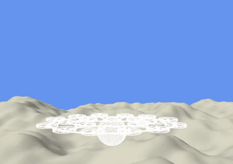

# nmpc_multirotor - NMPC Multirotor Drone Flight Control

[](https://doi.org/10.1109/TCST.2026.3672184)




Real-time visualization GIF (aircraft is white, NMPC prediction drawn in blue).

## About this Project

This repository contains the implementation of a
real-time capable Nonlinear Model Predictive Control (NMPC) for multirotor
aircrafts (e.g. quadcopter, hexacopter, octocopter, etc.).

* **Direct handling of actuator limits** within the NMPC, completely eliminating the need for a separate control allocation step.
* **Built-in compensation** for the delayed thrust response of (slow) motors.
* **~70% faster solve times** for highly redundant setups (e.g., 32 rotors).

**Hybrid Architecture for Simulation & Embedded Deployment:**
1. **The Simulation (Python):** The 6-DoF rigid-body physics simulation (incl. obstacle simulation) and the OpenGL 3D visualization are written in Python.
2. **The Controller (C via acados):** The actual NMPC solver is powered by the [`acados`](https://github.com/acados/acados) library. acados generates highly optimized, real-time capable **C code**.


## MCU requirements

The generated NMPC C code runs comfortably in real-time at 100 Hz for a complex
18-actuator setup with a prediction horizon of several seconds. This was
successfully tested on the Arm Cortex-A57 CPU (NVIDIA Jetson TX2), relying
entirely on the CPU without any GPU acceleration.

*Note on Hardware*: The generated code uses double-precision floating-point
support. While processors like the Cortex-A series handle
this, smaller microcontrollers, such as the Cortex-M series,
typically lack the computational power and hardware FPU (with double
precision) required for this software.

# Repository Structure

    .
    ├── acados/                 # Git submodule: acados library
    ├── img/                    # Media assets (for this README)
    ├── src/                    # Main source code directory
    │   ├── mpc_copter/
    │   │   └── copter_model_position.py # The core NMPC formulation and model definition
    │   ├── geodetic_toolbox.py          # Math helper functions
    │   ├── main.py                      # Main app: Generates C code and runs the simulation
    │   ├── multirotorsimulatorenv.py    # Physics simulation (6-DoF aircraft dynamics)
    │   ├── vehicleconfig.py             # Drone parameters (inertia, motor pos., etc.)
    │   └── visualization3d.py           # OpenGL 3D rendering of the simulation
    ├── stl/                    # 3D meshes (eVTOL, quadcopter) used by the visualizer
    ├── c_generated_code/       # [Auto-generated by main.py] C code for the NMPC solver
    ├── env.sh                  # Helper script for the Python virtual environment
    ├── pyproject.toml          # Python package configuration
    ├── setup.sh                # Setup script (builds acados, creates venv, installs deps)
    └── README.md

**How it works:** When executing `src/main.py`, the Python script reads the
mathematical NMPC model from `copter_model_position.py` and uses *acados* to
generate optimized C code into the `c_generated_code/` directory. The
`multirotorsimulatorenv.py` physics simulation then call this compiled C solver
in a closed-loop simulation, rendered by `visualization3d.py`.

# Installation

## Prerequisites

 - Linux, macOS or WSL on Windows
 - Python 3.8+
 - CMake
 - A C/C++ compiler (e.g., gcc, clang)
 - Git

For Ubuntu/Debian Linux and WSL with Ubuntu on Windows, install the
required packages:

    sudo apt update && sudo apt install -y \
        python3 python3-pip python3-venv \
        cmake build-essential git

(Optional) For the 3D visualization via Pygame + OpenGL (PyOpenGL requires
`libglu1-mesa` at runtime):

    sudo apt update
    sudo apt install libsdl2-2.0-0 libgl1 libglu1-mesa

## Clone and Setup

    git clone --recurse-submodules https://github.com/jnz/nmpc_multirotor.git
    cd nmpc_multirotor
    ./setup.sh

 - Check out the correct acados version as git submodule
 - Build acados with required options
 - Create a Python virtual environment (`venv_nmpc`)
 - Install the Python dependencies

## Running

    source env.sh   # for the virtual env.
    ./src/main.py

Note: On the first run acados will ask you to download the Tera renderer, press `y`:

    Do you wish to set up Tera renderer automatically?
    y/N? (press y to download tera or any key for manual installation)

# Simulation Controls

Use these keys to manually influence the drone:

| Key         | Command            | Direction     |
|-------------|--------------------|---------------|
| ← / →       | Lateral movement   | Left / Right  |
| ↓ / ↑       | Longitudinal       | Back / Forward|
| `j` / `k`   | Vertical thrust     | Up / Down     |
| `h` / `l`   | Yaw (rotation)      | Left / Right  |

# Note for WSL Users (Windows Subsystem for Linux)

This project runs fine on Windows with WSL2 and Ubuntu.

Windows WSL (WSLg + Mesa + D3D12) can have issues with hardware rendering on some GPUs (e.g. Intel
Arc). Workaround: Force software rendering:

    LIBGL_ALWAYS_SOFTWARE=true python src/main.py

# Citation

If you find this code useful in your research, please consider citing our paper:

> J. Zwiener, J. Stephan and C. Seiferth, "Real-Time Nonlinear Model Predictive Control of Large Multirotor Aircraft," in *IEEE Transactions on Control Systems Technology*, doi: [10.1109/TCST.2026.3672184](https://doi.org/10.1109/TCST.2026.3672184).

## BibTeX

```bibtex
@article{zwiener2026nmpc,
  author={Zwiener, Jan and Stephan, Johannes and Seiferth, Christoph},
  journal={IEEE Transactions on Control Systems Technology},
  title={Real-Time Nonlinear Model Predictive Control of Large Multirotor Aircraft},
  year={2026},
  volume={},
  number={},
  pages={1-7},
  doi={10.1109/TCST.2026.3672184}}
```

