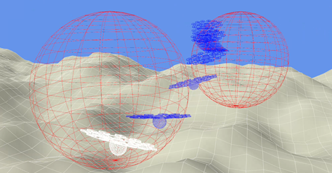

# nmpc_multirotor
NMPC Multirotor Drone Flight Control

# 🛠️ Setup

Prerequisites

 - Linux, macOS or WSL on Windows
 - Python 3.8+
 - CMake
 - A C++ compiler (e.g., gcc, clang)
 - Git

# Clone and Setup

    git clone --recurse-submodules https://github.com/youruser/nmpc_multirotor.git
    cd nmpc_multirotor
    ./setup.sh

This will:

 - Check out the correct acados version
 - Build acados with required options
 - Create a Python virtual environment (venv_nmpc)
 - Install all dependencies
 - Install acados_template in editable mode

# Running

    source env.sh
    ./src/main.py

